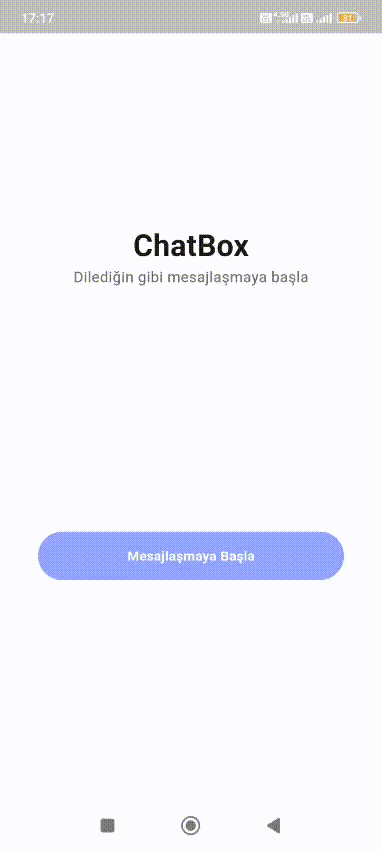
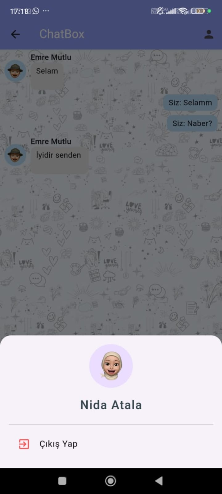
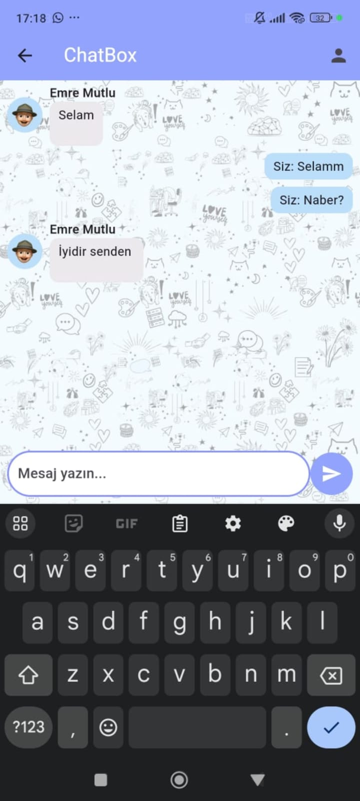
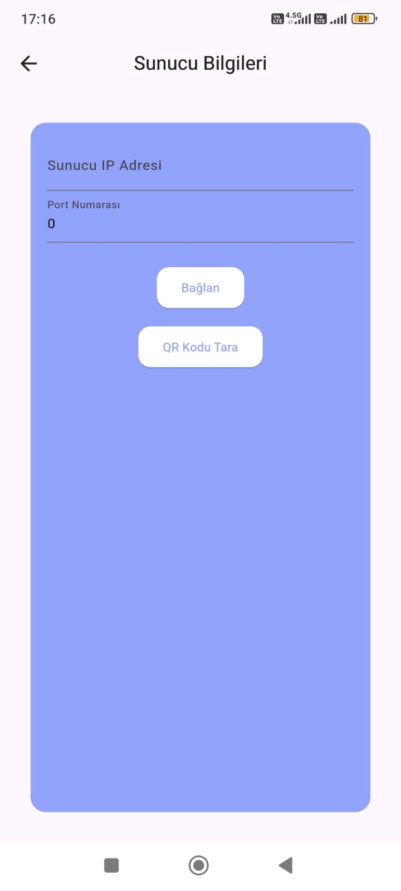
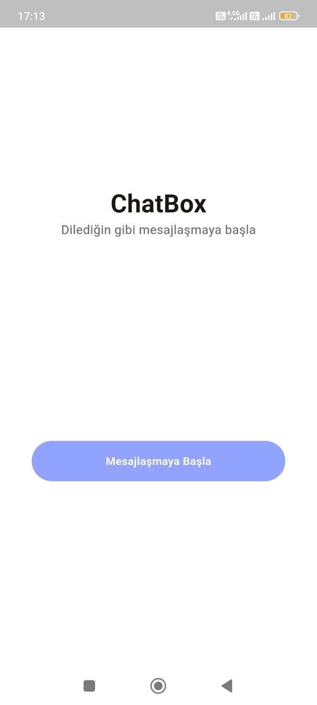

# TCP Chat App
Gerçek zamanlı **TCP Server-Client Socket** bağlantısı ile aynı ağdaki kullanıcıların mesajlaşmasını sağlayan uygulama.

Bu proje, aynı Wi-Fi ağına bağlı kullanıcıların **sunucu (server)** ve **istemci (client)** mantığında birbirleriyle mesajlaşmasını sağlar.
-  Ağ üzerinde **gerçek zamanlı iletişim**
-  Hızlı, basit ve güvenilir bağlantı
-  Mesaj gizliliğine odaklanan yapı  

## Tanıtım Videosu

## Ekran Görüntüleri

<table>
  <tr>
    <td></td>
    <td></td>
  </tr>
  <tr>
    <td></td>
    <td></td>
  </tr>
</table>

##  Kullanılan Teknolojiler
- Flutter (UI & Client)
- Dart (Socket bağlantıları)
- TCP Server Socket
- Riverpod (State management)

## Özellikler
- Aynı Wi-Fi ağına bağlı kullanıcılar arasında anlık mesaj gönderimi ve alımı yapılabilir.
- TCP socket bağlantısı sayesinde veri güvenli ve kayıpsız şekilde iletilir.
- Her kullanıcı, kendi adını, soyadını ve avatarını seçebilir.
- Mesaj geçmişi görüntüleme
- Sunucuya bağlanıldığında bağlantı doğrulanır ve başarılı giriş bildirimi yapılır. Bağlantı koparsa kullanıcıya anında bildirim gider.
- Birden fazla istemci aynı sunucuya bağlanabilir.
- Her istemcinin mesajları senkronize şekilde tüm kullanıcıların ekranında görünür.
